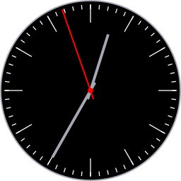

# JSON Clock Help
## JSON Clock App Helk

1. [Getting Started](#getting_started)
2. [Moving the Window](#moving-the-window)
3. [Resizing the Window](#resizing-the-window)
4. [Opening Clocks](#openint-clocks)
5. [Built-in Clocks](#built-in-clocks)
6. [Viewing Clock JSON](#viewing-json)
7. [Troubleshooting](#troubleshooting)

### Getting Started

JSON Clock displays clocks in a circular window. You can move, resize, and load clocks in JSON format.

### Moving the Window

Click and drag anywhere inside the circular window to move it around the screen.

### Resizing the Window

Hold <kbd>Shift</kbd> and click-drag to resize the window. Expand the window by moving down to the right. The window maintains a square aspect ratio.

### Opening Clocks

When opening a JSON file it must conform to the app's schem.

1. Use <strong>File → Open…</strong> to load additional clocks.
2. Use the Finder to drag-n-drop a file onto the clock.
3. Right click on the clock to easily load additional clocks.

### Built-in Clocks

The app comes with preloaded clocks. Each one can be selected and viewed without opening external JSON files.

### Viewing JSON

Use the <string>JSON → Show JSON…</strong> You can inspect and learn from the existing JSON. You can also copy the JSON to the <strong>Clipboard</string>.
