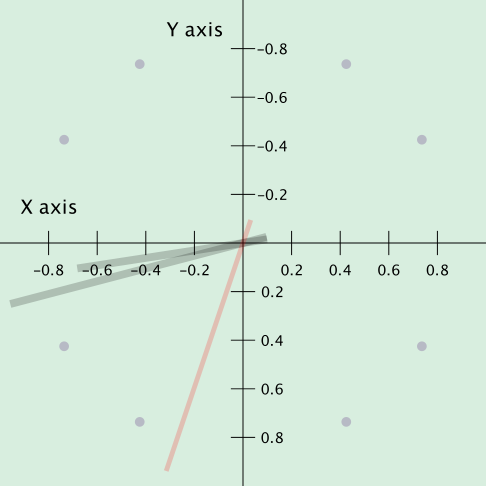

## JSON Schema

The schema to define clocks in JSON is minimal:

```json
{
  "name": "Name of Clock",
  "clock_face": [],
  "second_hand": [],
  "minute_hand": [],
  "hour_hand": []
}
```

| clock object keys | key description                                                                                      |
|-------------------|------------------------------------------------------------------------------------------------------|
| name              | Name of the clock.                                                                                   |
| description       | Description of the clock.                                                                            |
| clock_face        | List of shapes for the clock's face.                                                                 |
| second_hand       | List of shapes for the clock's second hand. It should be oriented towards 12:00 and will be rotated. |
| minute_hand       | List of shapes for the clock's minute hand.                                                          |
| hour_hand         | List of shapes for the clock's hour hand.                                                            |

### JSON Shapes Schema

#### Key Characteristics of the Coordinate System

- **Origin**: The origin is in the center of the clock face.
- **X-axis**: The x-values increase as you move to the right. This is the same as a standard Cartesian coordinate
  system.
- **Y-axis**: The y-values increase as you move down. This is the opposite of a standard Cartesian system, where
  y-values
  increase as you move up. This is consistent with computer screens and visual displays.
- **Drawing Area**: The radius of the clock face is 1.0. The application will scale that clock if the user increases the
  size.



There are 4 shapes that can be used to construct the clocks: "rectangle", "polygon", "text", "circle".

| shape object keys      | key description                                                                                                                                                                                | applicable shapes |
|------------------------|------------------------------------------------------------------------------------------------------------------------------------------------------------------------------------------------|-------------------|
| shape                  | String with the following possible string values: "rectangle", "polygon", "text", "circle".                                                                                                    | all               |
| x                      | x position of the shape.                                                                                                                                                                       | all but polygon   |
| y                      | y position of the shape.                                                                                                                                                                       | all but polygon   |
| color                  | shape color either format \#RRGGBB or \#AARRGGBB when alpha channel is desireed.                                                                                                               | all               |
| ticks                  | The shape will repeat around the clock the number of ticks (whole number >= 2 and <= 60).                                                                                                      | all               |
| text                   | text string to draw.                                                                                                                                                                           | text              |
| text_font              | font for text.                                                                                                                                                                                 | text              |
| text_size              | font size for text. The clock radius is always 1.0. "size": 0.15 means that at a 200×200 pixel window, the rendered font size will be 15px. Larger window sizes scale the font proportionally. | text              |
| text_styles            | font styles for text (separated by commas): "bold", "italic", or "plain".                                                                                                                      | text              |
| text_rotation          | rotation of the text (number > 0 and < 1.0). 0.25 is 3\:00, 0.50 is 6\:00, 0.75 is 9\:00.                                                                                                                                                  | text              |
| circle_radius          | radius of the circle.                                                                                                                                                                          | circle            |
| rectangle_fx           | from x position of the rectangle (number >= -1.0 and <= 1.0).                                                                                                                                  | rectangle         |
| rectangle_fy           | from y position of the rectangle (number >= -1.0 and <= 1.0).                                                                                                                                  | rectangle         |
| rectangle_tx           | to x position of the rectangle (number >= -1.0 and <= 1.0).                                                                                                                                    | rectangle         |
| rectangle_ty           | to y position of the rectangle (number >= -1.0 and <= 1.0).                                                                                                                                    | rectangle         |
| polygon_points         | list of points. Each point is a JSON object with x and y key-values.                                                                                                                           | polygon           |
